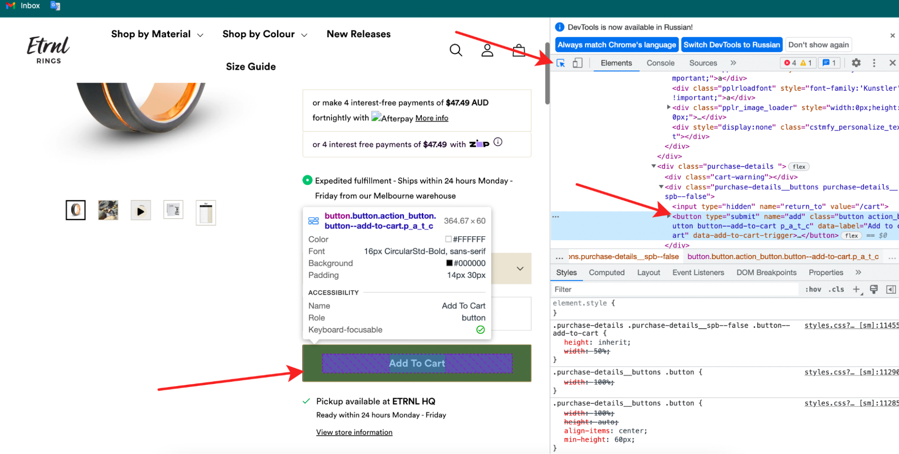

# How to embed the Trillion AR Try-On widget on a Shopify site?

## Prerequisites

- You have an account on the Trillion Dashboard
- You have purchased a package that includes the Try-on widget (Try-on or Try-on + 3D Viewer)
- You have at least one product that has "Done" status and has been published.

## To embed the AR widget on your site, you need to do the following

1. Add some files to the theme
    - Page template - file [trillion_tryon.liquid](./trillion_tryon.liquid "Go to file")
    - Set your Activation key
    - Predefined Trillion Button - file [trillion_tryon_button.liquid](./trillion_tryon_button.liquid "Go to file") ***Can be skipped if a custom button is used.***
2. Add an AR button to the site
3. Create a page for the Trillion Try-On widget

Let's take a closer look at each step below:

## 1. Add files

### a. Create an AR page template

You need to copy the page template file `trillion_tryon.liquid` to the templates folder

- Go to the Shopify admin panel, select Online Store → Themes → Click three dots → Edit code


- Click "Add a new template"


- In the popup window, you should enter:
  - Type: page
  - Pick: liquid
  - page. `trillion-tryon` .liquid

- Click done


- Download the [trillion_tryon.liquid](./trillion_tryon.liquid "Go to file") file and copy its contents

- Paste it into the template file you just created in the Shopify code editor (page.trillion-tryon.liquid)

### b. Set your Activation key

- Go to [Trillion Dashboard/Integration](https://dashboard.trillion.jewelry/integration "Go to dashboard")
- Click "Add a hostname"


- Enter your site hostname and click "Add"


- Click "Copy key" button in the Activation key section


- Set your Activation key at line 25


- Press "Save"

### c. Predefined Trillion Button

***Can be skipped if a custom button is used.***

- In the Shopify code editor, go to the Snippets folder
- Click "Add a new snippet"


- Create a snippet called `trillion_tryon_button`


- Download the [trillion_tryon_button.liquid](./trillion_tryon_button.liquid "Go to file") file and copy its contents

- Paste it into the snippet file you just created in the Shopify code editor (trillion_tryon_button.liquid)


- Press "Save"

## 2. Add an AR button to the site

Choose the integration option you wish (the Standard Trillion button is recommended)

### a. Standard Trillion button

Now we need to add the render snippet to the site in the place where we want the button to be.

Typically, the Try On button is placed next to the Add to Cart button. You can find the location of this button in the code using the developer tool. In the Chrome browser, turn it on by pressing the F12 keys (Windows); CMD+fn (MacOS) In developer mode, use the element selection icon to hover over the element next to which you want to embed a button



Now, in the code, copy the class that best describes what this element does. In our case, this is a button that adds a product to the cart, so we copy the “button-add-to-cart” class.


Now let's go to the theme code. We are looking for a file that contains a button element with the class we need. This is the most difficult because each theme has a different name for these files. But with a probability of 90%, the file will be located in one of the Assets, Templates or Snippets folders and be called product.liquid or product-form.liquid
In our case, the file is located in snippets and is called product__from.liquid. We find our element there by class name


And insert our snippet after the found element and save

The code looks like this

```liquid


```


### b. Custom (your own) button

You can use the contents of the [script-for-custom-button.js](./script-for-custom-button.js) file for your own button  
This file contains logic for opening the page with the Try-on widget

You need to add the contains of this file to your code.  
For example, you can create a new asset and upload file [script-for-custom-button.js](./script-for-custom-button.js)


Then, you need to add a CSS selector for your own button to the code (at line 10)

```javascript
const arButton = document.querySelector("#my-ar-button");
```

So, your button may look like this.

```javascript
<button id="my-ar-button">Try on in AR</button> 
```

Next, you should connect this asset with your theme.  
In the Layout folder, we are looking for the theme.liquid file, and in it is the `<head>` tag  
Next, right after `<head>`, you need to add a line of code and save

```html
<script src="{{ 'script-for-custom-button.js' | asset_url }}" defer type="module"></script>
```

## 3. Create a page for the Trillion Try-on widget

- Go back to the shopify admin panel, select Online Store → Pages → Click "Add page"


- Enter title: "Trillion Tryon"
- Select the theme template: "trillion-tryon"
- Press "Save"


### a. Preview with an unpublished theme

If you are trying to do Try-On integration in an unpublished theme, you may encounter some difficulties.  
Unfortunately, Shopify does not allow you to create pages using templates of unpublished themes.  
However, you can add a Try-on page template to the current theme by following section 1.a.  
Then create a page with a `trillion-tryon` template.
After these steps, the Tryon page in the preview for the unpublished topic should work.

## Result

As a result, you should see the Try on AR mode button in the product card. When you click the button, a page with AR Try-On should open.
