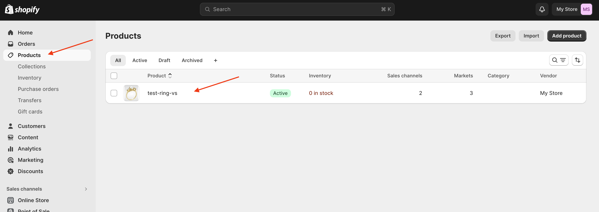
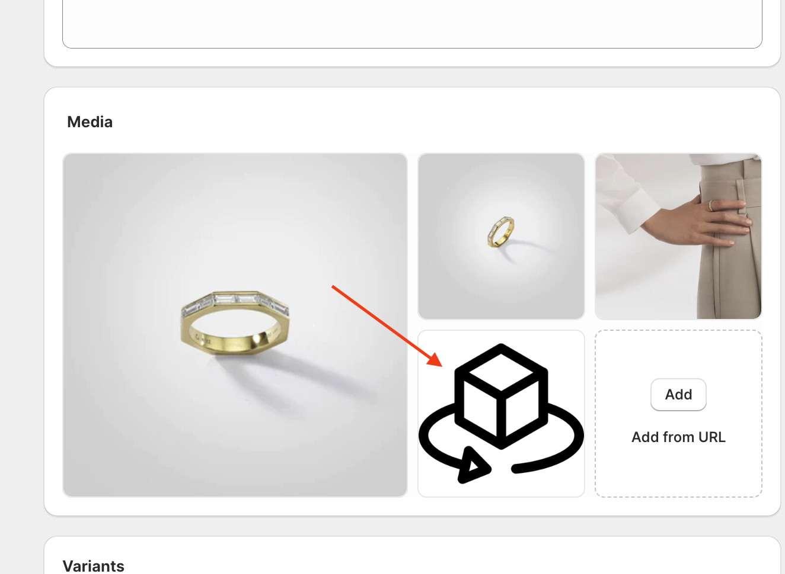
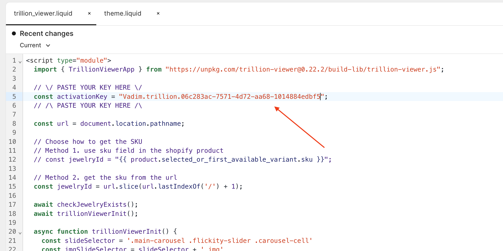
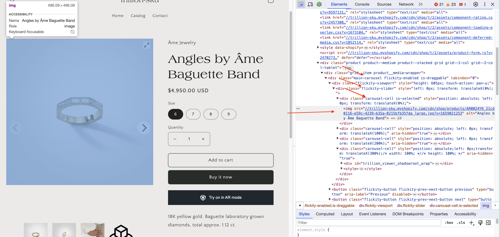

# How to embed the Trillion 3D Viewer on a Shopify site?

## Prerequisites

- You have an account on the Trillion Dashboard
- You have purchased a package that includes the 3D Viewer (3D Viewer or Try-on + 3D Viewer)
- You have at least one product that has "Done" status and has been published.

## To embed the Viewer on your site, you need to do the following

1. Add an image of your product as a preview for the viewer
2. Add a code snippet
3. Set your Activation key
4. Edit trillion_viewer.liquid regarding your theme
5. Choose how to get the SKU
6. Connect a snippet to your theme

Let's take a closer look at each step below:

## 1. Add an image of your product as a preview for the viewer

- Go to “Products” -> Choose a product where 3D model exists



- Prepare an image that will be a preview for your 3D viewer slide

- Name it as `trillion_viewer_3d_preview.<extension>`

[You can use our example](../assets/trillion_viewer_3d_preview.png)

- Add the image in the Media window  



- You can place the image in any order

## 2. Add a code snippet

You need to copy the snippet file `trillion_viewer.liquid` to the snippets folder

- Go to the Shopify admin panel, select Online Store → Themes → Click three dots → Edit code


- Click "Add a new snippet"


- In the popup window, you enter `trillion_viewer`


- Download the [trillion_viewer.liquid](./trillion_viewer.liquid "Go to file") file and copy its contents

- Paste it into the snippet file you just created in the Shopify code editor (page.trillion_viewer.liquid)

## 3. Set your Activation key

- Go to [Trillion Dashboard/Integration](https://dashboard.trillion.jewelry/integration "Go to dashboard")
- Click "Add a hostname"


- Enter your site hostname and click "Add"


- Click the "Copy key" button in the Activation key section


- Set your Activation key at line 5



- Press "Save"

## 4. Tell the script how to find slider image

- Our script will try to find the preview image that you added to your product and replace it by 3D Viewer. To do this, you need to tell our script a valid CSS selector with which it can find a place to embed the viewer.

  - Go to the web page of a product where you added a preview in step 1  
  - Open the developer panel (CTRL + F12 on Windows or F12 on Mac)  
  - Find the class of a component, which best describes the container for every slide. In my theme, this CSS selector will be `'.main-carousel .flickity-slider .carousel-cell'`



- Go back to `trillion_viewer.liquid` and change this part (line 46) to your class in the way to choose the last element of wrapped components


- Press "Save"

These are general tips, but each store is unique. Feel free to experiment. If you have any problems, please contact us.

## 5. Choose how to get the SKU

You need to choose a method of getting the SKU, it depends on what you specify in the SKU field in the product card in the Trillion Dashboard.

1. Get SKU from Product SKU field. If you use SKU field in your Shopify product.
`{{ product.selected_or_first_available_variant.sku }}` (default)
2. Get SKU from url `url.slice(url.lastIndexOf('/') + 1)`. If you don't use SKU field, you can use product name from url.

If you prefer method 2, you need to do some changes in `trillion_viewer.liquid`.

- Comment line 12
- Uncomment line 15

## 6. Connect a snippet to your theme

- In the Shopify Code editor, go to Layout -> theme.liquid and add this line right before closing `</body>` tag

```liquid
  
    
  
```


## Result

As a result, you should see an additional slide in the product card. Click on it. If this product is present in the Trillion database and it has a 3D model, a 3D viewer should appear instead of a picture.
