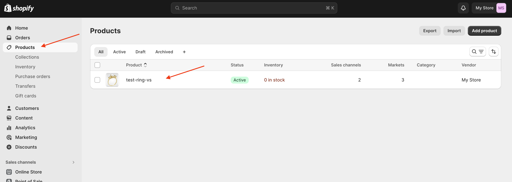
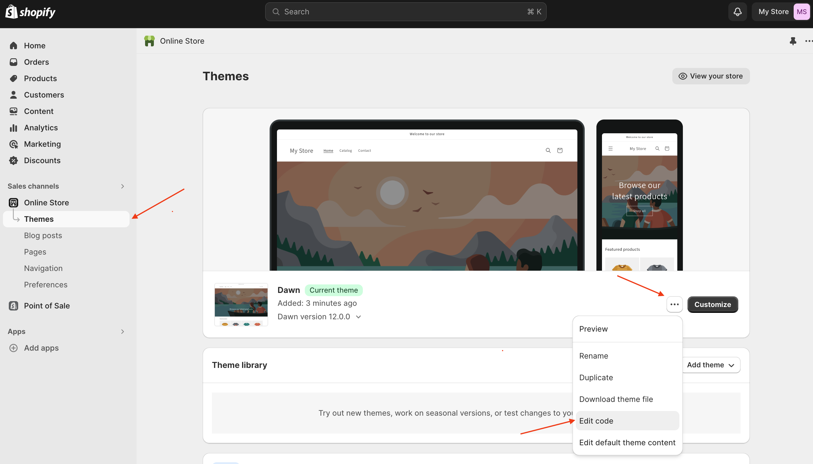
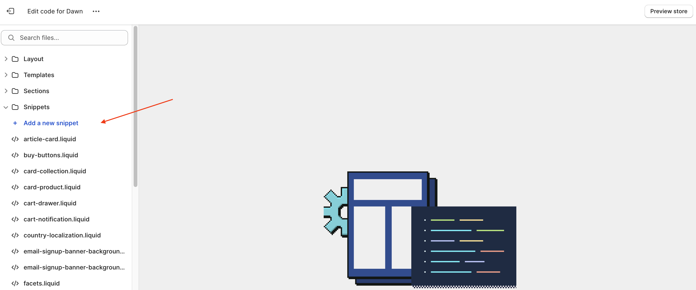
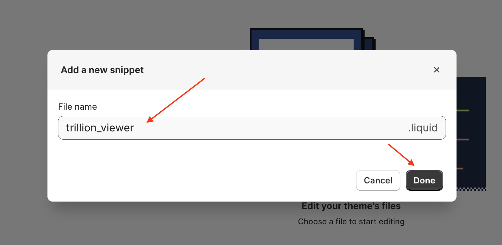
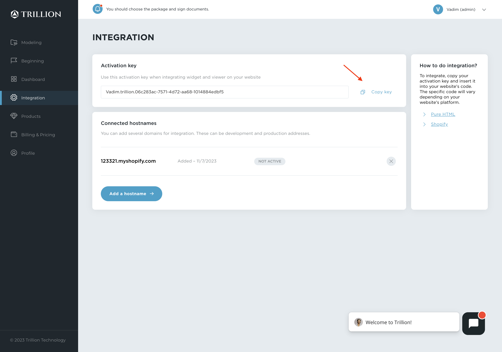
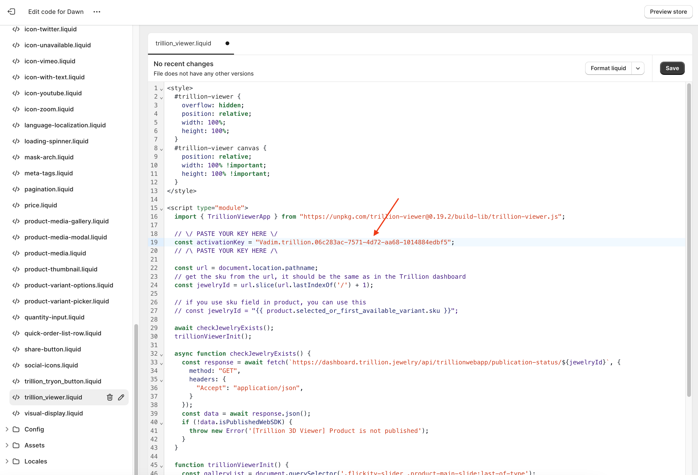
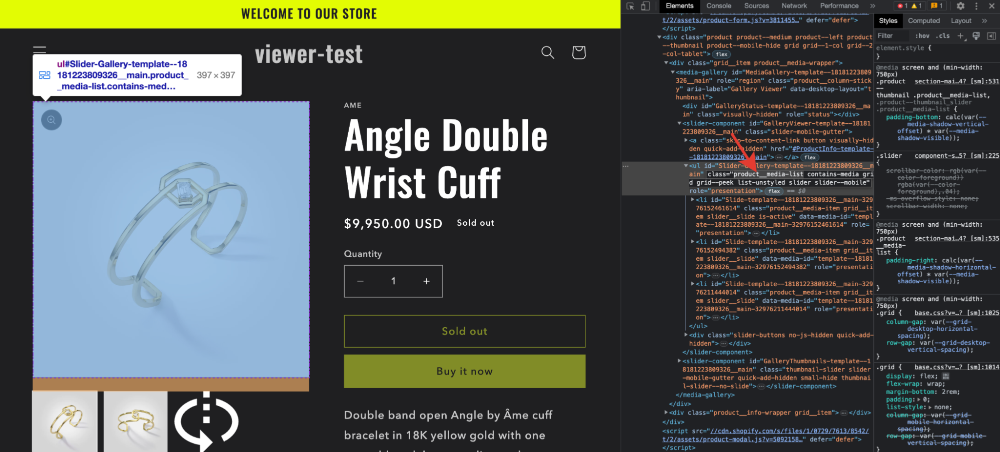
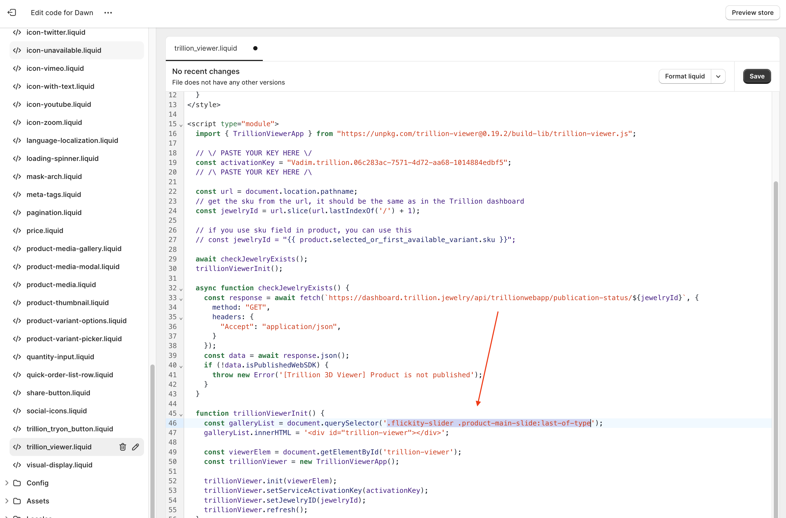
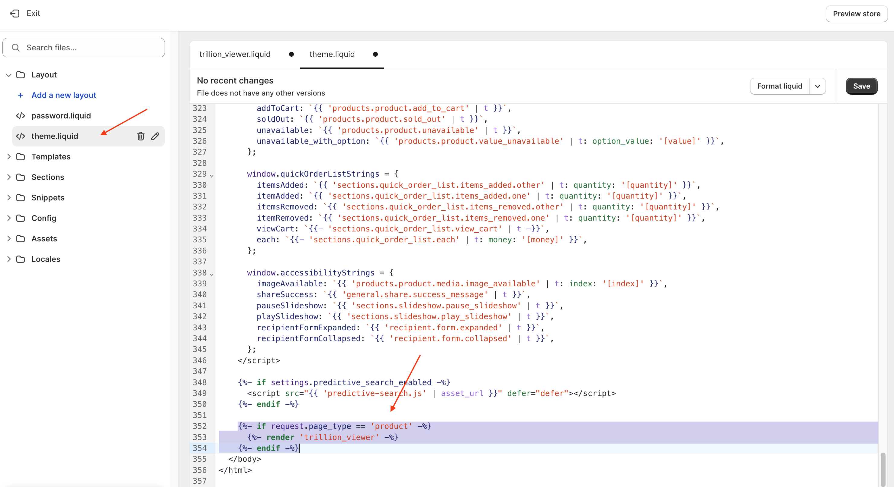

# How to embed the Trillion 3D Viewer on a Shopify site?

## Prerequisites

- You have an account on the Trillion Dashboard
- You have purchased a package that includes the 3D Viewer (3D Viewer or Try-on + 3D Viewer)
- You have at least one product that has "Done" status and has been published.

## To embed the Viewer on your site, you need to do the following

1. Add an image of your product as a thumbnail for the viewer
2. Add a code snippet
3. Set your Activation key
4. Edit trillion_viewer.liquid regarding your theme
5. Connect a snippet to your theme

Let's take a closer look at each step below:

## 1. Add an image of your product as a thumbnail for the viewer

- Go to “Products” -> Choose a product where 3D model exists



- Add an image that will be a thumbnail for your 3D viewer slide

## 2. Add a code snippet

You need to copy the snippet file `trillion_viewer.liquid` to the snippets folder

- Go to the Shopify admin panel, select Online Store → Themes → Click three dots → Edit code



- Click "Add a new snippet"



- In the popup window, you enter `trillion_viewer`



- Download the [trillion_viewer.liquid](./trillion_viewer.liquid "Go to file") file and copy its contents

- Paste it into the snippet file you just created in the Shopify code editor (page.trillion_viewer.liquid)

## 3. Set your Activation key

- Go to [Trillion Dashboard/Integration](https://dashboard.trillion.jewelry/integration "Go to dashboard")
- Click "Add a hostname"


- Enter your site hostname and click "Add"


- Click the "Copy key" button in the Activation key section



- Set your Activation key at line 19



- Press "Save"

## 4. Edit trillion_viewer.liquid regarding your theme

- Go to the web page of a product where you added a thumbnail in step 1.a -> Open developer panel (CTRL + F12 on Windows or F12 on Mac) -> And find the class of a component, which is a wrapper for a gallery slides. In my theme, this class name is `product__media-list`



- Go to Edit Code -> Assets -> trillion_viewer.js.liquid and change this part (line 46) to your class in the way to choose the last element of wrapped components



- Press "Save"

## 5. Connect a snippet to your theme

- In the Shopify Code editor, go to Layout -> theme.liquid and add this line right before right `</body>` tag

```liquid
  
    
  
```


